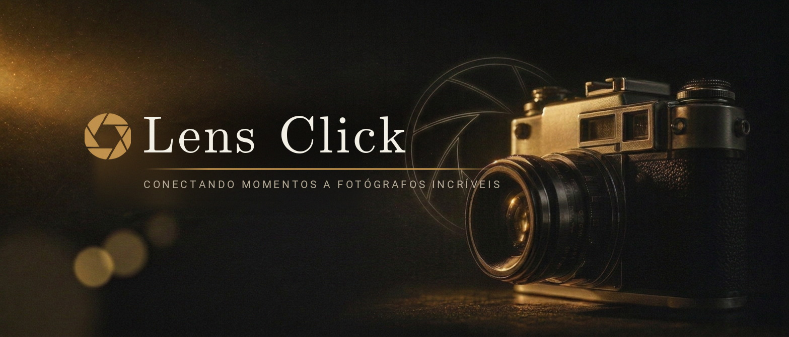
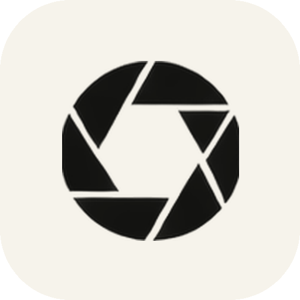

<p align="center">
  
</p>

<p align="center">
  
</p>

<h1 align="center">Lens Click</h1>

<p align="center"><em>Conectando momentos a fotógrafos incríveis.</em></p>

<p align="center">
  
  
  
  
  
  
  
</p>

---

## 📸 Sobre o projeto

O **Lens Click** é o aplicativo Android da plataforma LensClick — um ponto de encontro entre **quem quer eternizar um momento** e **fotógrafos profissionais**.

De um lado, o cliente descreve o que precisa (casamento, ensaio, evento, aniversário, corporativo), compara profissionais, pede orçamentos e conversa direto com quem vai clicar. Do outro, o fotógrafo mantém um perfil com especialidade, cidade, bio e preço inicial, acompanha os pedidos que chegam, organiza a agenda e responde em um chat em tempo real.

Esta versão entrega **17 telas navegáveis**, interface 100% em português do Brasil e visual inspirado em fotografia editorial — papel, tinta e toques de dourado. Toda a experiência funciona ponta a ponta no aparelho, com os dados persistidos localmente em **Room**; o backend da plataforma ainda não está conectado.

## ✨ Funcionalidades

### Para quem contrata

| Tela | O que faz |
|---|---|
| 🪪 **Onboarding** | Boas-vindas em tela cheia com fotografia, gradiente escuro e a marca aplicada em dourado e off-white |
| 🧑🤝🧑 **Tipo de conta** | Escolha entre conta de cliente ou de fotógrafo antes do cadastro |
| 🔐 **Login & Cadastro** | Autenticação de demonstração local, com validação de formulário (senha × confirmação, aceite dos Termos), aviso de e-mail já cadastrado e recuperação de senha demonstrativa |
| 🏠 **Início** | Localização, busca rápida, categorias (Casamento, Ensaio, Eventos, Infantil, Corporativo), fotógrafos em destaque e portfólios em alta |
| 🔎 **Descobrir** | Busca por nome ou estilo, filtros por categoria, favoritos e contador de resultados |
| 👤 **Perfil do fotógrafo** | Bio, especialidades, estatísticas (experiência, ensaios, satisfação), avaliações, portfólio e preço "a partir de" |
| 💰 **Solicitar orçamento** | Formulário com tipo, data, local, duração, descrição e informações adicionais — a solicitação é salva no banco local |
| 📋 **Meus orçamentos** | Abas *Solicitações · Propostas · Favoritos* e cartões expansíveis com status (Aguardando, Proposta recebida, Aceito, Recusado) |
| 💬 **Conversas & Chat** | Lista com busca e indicador de online, chat com balões, envio de mensagens e compartilhamento de portfólio |
| 👤 **Conta** | Perfil do usuário, menu de ações (dados, configurações, segurança, notificações, ajuda, sobre) e sair da conta |

### Para quem fotografa

| Tela | O que faz |
|---|---|
| 📊 **Painel profissional** | Métricas de pedidos (novos, confirmados, total), ações rápidas e pedidos recentes |
| 📨 **Pedidos** | Solicitações de clientes disponíveis para atender |
| 🗓️ **Agenda** | Trabalhos já confirmados pelo fotógrafo |
| ♙ **Perfil profissional** | Bio, cidade, especialidade e preço inicial do cadastro, com alternância entre modo fotógrafo e modo cliente |
| 🧭 **Navegação** | Barra inferior flutuante (5 abas no modo cliente, 4 no modo profissional) e Navigation Compose entre as 17 telas |

## 🗺️ Fluxo de telas

```
Cliente
  Onboarding ─▶ Tipo de conta ─▶ Login ou Cadastro ─▶ Início
      ├─▶ Descobrir ─▶ Perfil do fotógrafo ─▶ Solicitar orçamento
      ├─▶ Meus orçamentos
      ├─▶ Conversas ─▶ Chat
      └─▶ Conta

Fotógrafo
  Onboarding ─▶ Tipo de conta ─▶ Cadastro de fotógrafo ─▶ Painel profissional
      ├─▶ Pedidos
      ├─▶ Agenda
      └─▶ Perfil
```

A navegação usa `Navigation Compose` em uma única `Activity`. Telas de detalhe mantêm uma pilha de retorno; login, logout, abas e troca de modo limpam a pilha anterior. Links profundos ainda dependem de rotas e domínio aprovados.

## 🧱 Stack e arquitetura

| Componente | Tecnologia |
|---|---|
| Linguagem | [Kotlin](https://kotlinlang.org) 2.2.10 |
| UI | [Jetpack Compose](https://developer.android.com/compose) + [Material 3](https://m3.material.io) (BOM `2024.09.00`) |
| Build | Gradle 9.3.1 (wrapper) + Android Gradle Plugin 9.1.1 |
| SDKs | `compileSdk` 36 · `minSdk` 24 (Android 7.0+) · `targetSdk` 36 |
| JVM | Toolchain 21 (provisionado via Foojay) |
| Dados | [Room](https://developer.android.com/training/data-storage/room) 2.8.5 (`photographers`, `budgets`, `users`) + `Flow` |
| Arquitetura | `:app` único, camadas `ui/` → `ViewModel` → `Repository` → `DAO` |
| Empacotamento | `com.example.lensclickapp` · versão 1.0 |

```
UI (Compose)  ──▶  LensClickViewModel  ──▶  LensClickRepository  ──▶  LensClickDao  ──▶  Room
       ▲                    │                        │
       └──── StateFlow ─────┘             credencial demo somente em memória
```

- **`ui/`** — as 17 telas, componentes reutilizáveis (`PrimaryButton`, `LensField`, `BottomNav`, `LogoAsset`) e o tema Material 3.
- **`ui/LensClickViewModel`** — estado observável (`photographers`, `budgets`, `currentUser`) e as ações de login, cadastro, orçamento e logout.
- **`data/`** — entidades `Photographer`, `Budget` e `User`; o `Repository` semeia dados de exemplo na primeira execução. **O Room armazena perfis, fotógrafos e orçamentos, mas não armazena senhas nem hashes de senha.** Os hashes usados pela autenticação de demonstração ficam apenas em memória durante o processo.

## 🔑 Conta de demonstração

O app cria uma conta de cliente e um catálogo de fotógrafos na primeira execução. A autenticação abaixo é **somente para demonstração local**:

| Campo | Valor |
|---|---|
| E-mail | `seu@email.com` |
| Senha | `lensclick` |

A credencial de demonstração não é persistida no Room. O hash fica somente em memória e desaparece quando o processo do aplicativo é encerrado. Isso **não é autenticação de produção** e será substituído pelo contrato de autenticação do backend antes de uma release conectada.

Para conhecer o **modo fotógrafo**, use *Cadastrar como fotógrafo* no fluxo de criação de conta — o painel profissional abre automaticamente para contas com esse papel.

## 🎨 Identidade visual

O design segue uma direção **editorial e atemporal**, inspirada na fotografia analógica:

| Cor | Hex | Uso |
|---|---|---|
| 🖤 Tinta (*Ink*) | `#11110F` | Fundos fortes, botões primários e texto principal |
| 🤍 Papel | `#F6F3EB` | Fundo geral do app e da splash |
| ⚪ Branco | `#FFFEFA` | Superfícies elevadas (cartões, campos) |
| 🩶 Linha | `#E2DDD2` | Bordas e divisórias |
| 🩶 Cinza | `#716D64` | Texto secundário e placeholders |
| 🟡 Dourado | `#9A6A24` | Destaques, avaliações e preços |

**Formatos da marca**

| Formato | Arquivo | Onde aparece |
|---|---|---|
| Monograma *LC* completo — letras sobrepostas, obturador e filetes | `drawable-nodpi/lens_click_mark.png` | Splash, telas de autenticação e cabeçalho das telas internas |
| Monograma *LC* compacto | `drawable-*/ic_launcher_foreground.png` | Ícone do app e camada *monochrome* dos ícones temáticos |
| Lockup transparente do monograma | `assets/brand_lockup.png` | Arte-base da marca para materiais editoriais |
| Ícone da marca sobre papel | `assets/icon.png` | Apresentação da marca neste README e em outras peças |
| Arte-base sem letreiro | `assets/hero.jpg` | Fotografia original sem texto, pronta para receber novas composições |
| Banner montado apenas com o monograma | `assets/banner.jpg` | Cabeçalho deste README |

Na splash, o monograma é declarado em `Theme.LensClickApp.Starting` (`windowSplashScreenAnimatedIcon`) usando `@drawable/splash_icon`, gerado nas densidades `mdpi`→`xxxhdpi` dentro da especificação do Android 12+: **caixa de 288 dp com o desenho dentro do círculo de 192 dp** que o sistema exibe. A arte do monograma é desenhada em preto sólido e recolorida em tempo de execução (`BlendMode.SrcIn`), o que permite usar a mesma logo em off-white sobre a fotografia do Onboarding e em dourado nas telas claras.

## 🗂️ Estrutura do projeto

```
LensClickApp/
├── app/
│   ├── build.gradle.kts                  # configuração do módulo Android
│   └── src/
│       ├── main/
│       │   ├── AndroidManifest.xml
│       │   ├── java/com/example/lensclickapp/
│       │   │   ├── LensClickApplication.kt   # Application + repositório
│       │   │   ├── MainActivity.kt           # Activity única (edge-to-edge + tema)
│       │   │   ├── data/
│       │   │   │   ├── LensClickData.kt      # entidades Photographer/Budget/User + mock
│       │   │   │   ├── LensClickDatabase.kt  # Room + migração
│       │   │   │   ├── LensClickDao.kt
│       │   │   │   └── LensClickRepository.kt
│       │   │   └── ui/
│       │   │       ├── LensClickApp.kt       # as 17 telas + Navigation Compose
│       │   │       ├── LensClickViewModel.kt
│       │   │       └── theme/                # Color, Type e LensClickAppTheme (M3)
│       │   └── res/
│       │       ├── drawable-nodpi/           # fotos e marca (bitmaps em tamanho natural)
│       │       ├── drawable-*/               # ícone da splash e camadas do ícone do app
│       │       ├── mipmap-*/                 # ícones do launcher (adaptativo + legado)
│       │       └── values/                   # cores, tema e strings (pt-BR)
│       ├── androidTest/                      # testes instrumentados (exemplo)
│       └── test/                             # testes de unidade (exemplo)
├── assets/                                   # banner, arte-base, ícone e lockup da marca
├── gradle/
│   ├── libs.versions.toml                    # catálogo central de versões
│   └── wrapper/                              # Gradle 9.3.1
├── build.gradle.kts                          # build raiz
├── settings.gradle.kts                       # módulos e repositórios
└── gradlew / gradlew.bat                     # wrapper multiplataforma
```

## 🚀 Como executar

### Pré-requisitos

- **Android Studio** recente (com suporte a AGP 9.x) — ou apenas um JDK 17 ou superior na linha de comando
- **SDK Platform 36** instalado no Android SDK Manager

### Pelo Android Studio

1. **File ▸ Open** e selecione a pasta do projeto;
2. Aguarde o *Gradle Sync* terminar;
3. Conecte um aparelho (ou abra um emulador) e clique em **Run ▶**.

### Pela linha de comando

```bash
# gera o APK de debug
./gradlew assembleDebug
# APK gerado em: app/build/outputs/apk/debug/app-debug.apk

# instala direto no aparelho/emulador conectado
./gradlew installDebug

# roda os testes de unidade
./gradlew testDebugUnitTest
```

> 💡 No Windows, use `gradlew.bat` no lugar de `./gradlew`.

## 📌 Status do projeto

Esta versão é uma **interface completa e navegável** com dados locais: onboarding, autenticação de demonstração, descoberta de fotógrafos, orçamentos, conversas e as telas do modo profissional funcionam localmente no cliente. O Room persiste os dados de aplicação, mas **não persiste credenciais ou hashes de senha**. O backend da plataforma ainda não está conectado.

Próximos passos naturais:

- definir o **contrato de autenticação móvel revogável** com o backend da plataforma LensClick;
- conectar a UI ao backend somente depois desse contrato, começando por autenticação e conta;
- definir rotas com identificadores reais e domínio aprovado antes de adicionar deep links para perfil e conversas;
- separar explicitamente modelos/cliente HTTP remotos dos modelos locais de Room.

O planejamento consolidado está em:

- [`docs/ROADMAP.md`](docs/ROADMAP.md) — ordem de evolução do aplicativo;
- [`docs/PLANO_CONVERGENCIA_VALIDACAO_PUBLICACAO.md`](docs/PLANO_CONVERGENCIA_VALIDACAO_PUBLICACAO.md) — integração com a plataforma, 2FA, validação e Google Play;
- [`docs/HANDOFF.md`](docs/HANDOFF.md) — estado técnico e continuidade do trabalho.

## 📄 Licença

Este repositório ainda não possui licença declarada. Consulte os mantenedores antes de reutilizar qualquer parte do código.

---

<p align="center">
  Feito com ❤️ e uma boa lente no Brasil · <b>Lens Click</b> 📷
</p>
